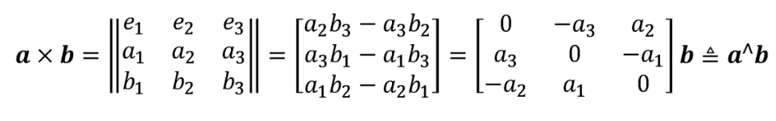
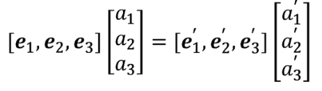
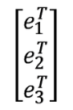

### 向量外积：
外积的结果是一个向量，它的方向垂直于这两个向量，大小为 |a||b|sin⟨a,b⟩，是两个向量张成的四边形的有向面积。  
对于外积运算，引入∧符号，把a写成一个反对称矩阵（Skew-symmetric matrix），把外积a × b写成了矩阵与向量的乘法a∧b，把它变成了线性运算。  
这意味着任意向量都对应着唯一的一个反对称矩阵，反之亦然。  
  

### 坐标系间的欧氏变换：
设某个单位正交基 (e1, e2, e3) 经过一次旋转变成了 (e1', e2', e3') ，那么，对于同一个向量 a（该向量并没有随着坐标系的旋转而发生运动），它在两个坐标系下的坐标为[a1, a2, a3]和[a1', a2', a3']。因为向量本身没变，根据坐标的定义，有：  
     
对上述等式的左右两边同时左乘：
     
那么左边的系数就变成了单位矩阵，把中间的矩阵拿出来，定义成一个旋转矩阵R：
  
该矩阵各分量是两个坐标系基的内积，由于基向量的长度为1，所以实际上是各基向量的夹角之余弦。所以这个矩阵也叫方向余弦矩阵（Direction Cosine matrix）。  
行列式为1的正交矩阵==旋转矩阵，以把 n 维旋转矩阵的集合定义如下：

SO(n) 是特殊正交群（Special Orthogonal Group）的意思。这个集合由n维空间的旋转矩阵组成，特别地，SO(3) 就是指三维空间的旋转。  
注：由于旋转矩阵为正交矩阵，它的逆（即转置）描述了一个相反的旋转  
在欧氏变换中，除了旋转之外还有平移。考虑世界坐标系中的向量a，经过一次旋转（用R描述）和一次平移t后，得到了a′，把旋转和平移合到一起，有：a′ = Ra + t. t称为平移向量。平移部分只需把平移向量加到旋转之后的坐标上。
##### 总结
用一个旋转矩阵R和一个平移向量t完整地描述了一个欧氏空间的坐标变换关系。定义坐标系1、坐标系2，那么向量a在两个系下坐标为 a1, a2 ，完整的写法：$a_1 = R_{12}a_2 + t_{12}.$  
注：行列式为1是人为定义的，实际上只要求它的行列式为 ±1，但行列式为 −1 的称为瑕旋转，即一次旋转加一次反射。

### 变换矩阵与齐次坐标：
矩阵T称为变换矩阵  
  
变换矩阵T具有比较特别的结构：左上角为旋转矩阵，右侧为平移向量，左下角为0 向量，右下角为 1。这种矩阵又称为特殊欧氏群（Special Euclidean Group）  
  
与 SO(3) 一样，求解该矩阵的逆表示一个反向的变换：  
    
  
  
### Eigen的使用  
```
sudo apt install libeigen3−dev
```  
相比于其他库，Eigen 的特殊之处在于，它是一个纯用头文件搭建起来的库。这意味着你只能找到它的头文件，而没有.so 或.a 那样的二进制文件。在使用时，只需引入 Eigen 的头文件即可，不需要链接库文件。  
1. Eigen 提供的矩阵和 MATLAB 很相似，几乎所有的数据都当作矩阵来处理。但是，为了实现更好的效率，在 Eigen 中需要指定矩阵的大小和类型。对于在编译时期就知道大小的矩阵，处理起来会比动态变化大小的矩阵更快一些。因此，像旋转矩阵、变换矩阵这样的数据，完全可在编译时期确定它们的大小和数据类型。

2. Eigen 矩阵不支持自动类型提升，这和 C++ 的内建数据类型有较大差异。在 C++ 程序中，我们可以把一个 float 数据和 double 数据相加、相乘，编译器会自动把数据类型转换为最合适的那种。而在 Eigen 中，出于性能的考虑，必须显式地对矩阵类型进行转换。而如果忘了这样做，Eigen 会提示你一个“YOU MIXED DIFFERENT NUMERIC TYPES ...”的编译错误。你可以尝试找一下这条信息出现在错误提示的哪个部分。如果错误信息太长最好保存到一个文件里再找。

3. 同理，在计算过程中也需要保证矩阵维数的正确性，否则会出现“YOU MIXED MATRICES OF DIFFERENT SIZES”错误。若发现 Eigen 出错，你可以直接寻找大写的部分，推测出了什么问题。

4. Eigen 官网教程：https://link.zhihu.com/?target=http%3A//eigen.tuxfamily.org/dox-devel/modules.html

