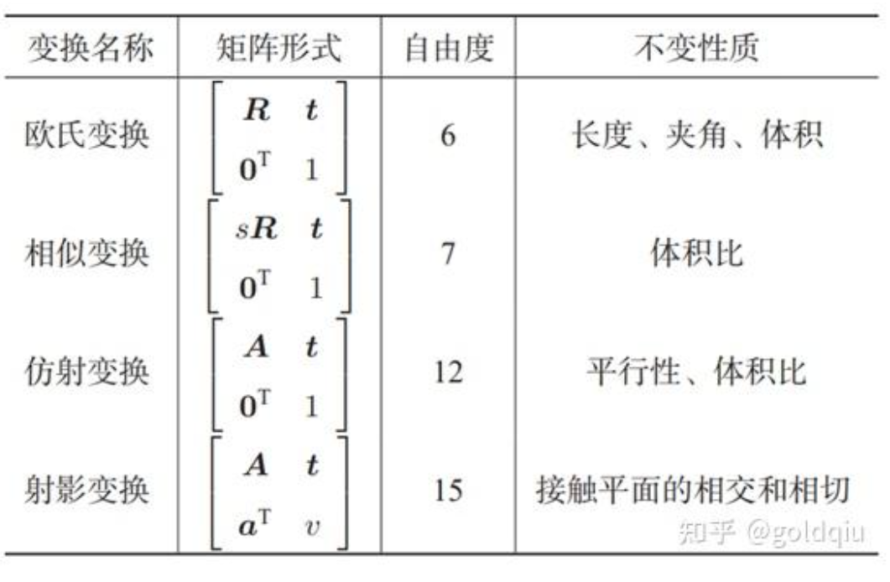

欧氏变换**保持了向量的长度和夹角**，相当于我们把一个**刚体原封不动**地进行了移动或旋转，不改变它自身的样子。其他几种变换则会**改变它的外形**。它们都拥有类似的矩阵表示。

### 相似变换
相似变换比欧氏变换多了一个自由度，它允许物体进行均匀缩放。即在旋转矩阵块上乘一个缩放因子s。  
$T_S = \begin{bmatrix}
s\boldsymbol{R} & \boldsymbol{t} \\
\boldsymbol{0}^T & 1
\end{bmatrix}$  
三维相似变换的集合也叫做相似变换群，记作Sim(3)。  

### 仿射变换
与欧氏变换不同的是，仿射变换**只要求A是一个可逆矩阵**，而不必是正交矩阵。  
仿射变换也叫正交投影。经过仿射变换之后，立方体就不再是方的了，但是各个面仍然是平行四边形。  
$T_A = 
\begin{bmatrix}
A & t \\
0^T & 1
\end{bmatrix}$

### 射影变换
射影变换是最一般的变换，左上角为可逆矩阵A，右上角为平移t，左下角为缩放a。  
$T_P = \begin{bmatrix}
A & t \\
a^{T} & v
\end{bmatrix}$  
由于采用了齐次坐标，当 v≠0时，我们可以对整个矩阵除以 v 得到一个右下角为 1 的矩阵；否则得到右下角为 0 的矩阵。  
因此，2D 的射影变换一共有 8 个自由度，3D 则共有 15 个自由度。  
从真实世界到相机照片的变换可以看成一个射影变换。可以想象一个原本方形的地板砖，在照片当中是什么样子：首先，它不再是方形的。由于近大远小的关系，它甚至不是平行四边形，而是一个不规则的四边形。

### 总结：
在“不变性质”中，从上到下是有包含关系的。例如，欧氏变换除了保体积之外，也具有保平行、相交等性质。  
  
从真实世界到相机照片的变换是一个射影变换。如果相机的焦距为无穷远，那么这个变换为仿射变换。  

---------------------------
## Eigen几何模块
Eigen中对各种形式的表达方式总结如下。每种类型都有单精度和双精度两种数据类型，不能由编译器自动转换。以双精度为例，把最后的d改成f，即得到单精度的数据结构。

• 旋转矩阵（3 × 3）：Eigen::Matrix3d。

• 旋转向量（3 × 1）：Eigen::AngleAxisd。

• 欧拉角（3 × 1）：Eigen::Vector3d。

• 四元数（4 × 1）：Eigen::Quaterniond。

• 欧氏变换矩阵（4 × 4）：Eigen::Isometry3d。

• 仿射变换（4 × 4）：Eigen::Affine3d。

• 射影变换（4 × 4）：Eigen::Projective3d。