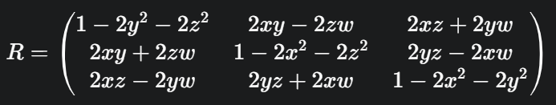

## 更紧凑地描述旋转和平移的方式

### 旋转向量
事实上，任意旋转都可以用一个旋转轴和一个旋转角来刻画。  
于是，我们可以使用一个向量，其**方向与旋转轴一致**，而**长度等于旋转角**。这种向量称为旋转向量（或轴角/角轴，Axis-Angle）。  
同样，对于变换矩阵，我们使用**一个旋转向量和一个平移向量**即可表达一次变换。这时的变量维数正好是六维。    
考虑用R表示的旋转。如果用旋转向量来描述，假设旋转轴为一个单位长度的向量n，角度为 θ，那么向量 θn也可以描述这个旋转。  
 
从旋转向量到旋转矩阵的转换过程（罗德里格斯公式（Rodrigues’s Formula ））：  
$\boldsymbol{R} = \cos\theta\boldsymbol{I} + (1 - \cos\theta)\boldsymbol{n}\boldsymbol{n}^{\mathrm{T}} + \sin\theta\boldsymbol{n}^{\wedge}$  
符号∧是向量到反对称矩阵的转换符。  
  
反之，我们也可以计算从一个旋转矩阵到旋转向量的转换:  
$\mathrm{tr}(\boldsymbol{R}) = \cos\theta\mathrm{tr}(\boldsymbol{I}) + (1 - \cos\theta)\mathrm{tr}(\boldsymbol{n}\boldsymbol{n}^{\mathrm{T}}) + \sin\theta\mathrm{tr}(\boldsymbol{n}^{\wedge}) $  
$ = 3\cos\theta + (1 - \cos\theta) = 1 + 2\cos\theta $  
$\theta = \arccos\left(\frac{\text{tr}(\boldsymbol{R}) - 1}{2}\right)$

### 欧拉角
使用了3个分离的转角，把一个旋转分解成 3 次绕不同轴的旋转，比较直观。  
ZYX转角相当于把任意旋转分解成以下3个轴上的转角：
1. 绕物体的Z轴旋转，得到偏航角 yaw；
2. 绕旋转之后的Y轴旋转，得到俯仰角 pitch；
3. 绕旋转之后的 X 轴旋转，得到横滚角 roll  
此时，可以使用 $[r,p,y]^{T} $这样一个三维的列向量描述任意旋转。  

欧拉角的一个重大缺点是会碰到**万向锁问题**（Gimbal Lock ）：在俯仰角为 ±90◦时，第一次旋转与第三次旋转将使用同一个轴，使得系统丢失了一个自由度（由 3 次旋转变成了 2 次旋转）。这被称为奇异性问题，只要想用3个实数来表达三维旋转时，都会不可避免地碰到。  
旋转向量也有奇异性，发生在转角θ超过2π而产生周期性时

### 四元数（Quaternion）
一个四元数 q 由一个实部和三个虚部组成，可以写成：  
$q=w+xi+yj+zk$  
其中：  
· w 是实部。  
· x, y, z 是虚部。  
· i, j, k 是虚数单位，它们满足以下关系：  
$i^2 = j^2 = k^2 = ijk = −1 $   
通常将四元数写成一个标量（实部）和一个向量（虚部）的形式：
$q=[w,v]=[w,(x,y,z)]$   
#### 四元数与旋转
四元数表示三维旋转的核心思想是：用一个单位四元数来表示绕着某个轴旋转一定角度。  
一个单位四元数（模长为 1 的四元数）可以表示为：  
$q = [cos(\theta/2), sin(\theta/2)*n]$  
其中$n=(n_x, n_y, n_z)$ 是一个三维单位向量，表示旋转轴; $\theta$ 是绕这个轴旋转的角度.
  
要用这个四元数 q 来旋转一个三维向量 p=(p_x, p_y, p_z)，我们需要先将 p 转换成一个虚四元数 P=[0,p]，然后进行以下运算：
$P' = q·P·q^{-1}$
#### 四元数与旋转矩阵的转换
四元数和旋转矩阵可以相互转换。给定一个单位四元数 q=[w,x,y,z]，对应的旋转矩阵 R 为:  
    
反过来，从旋转矩阵 R 转换到四元数，可以通过矩阵的迹（Trace）来计算。
  
#### 为什么四元数更好？
避免万向锁：欧拉角在某些特定角度下会失去一个自由度，导致表示不唯一，这就是著名的万向锁（Gimbal Lock）。四元数不会出现这个问题，它总是能稳定地表示任何旋转。

更紧凑：四元数只需要 4 个数来表示旋转，而旋转矩阵需要 9 个数。

插值更平滑：在计算机图形学中，进行旋转动画时，四元数提供了更平滑的插值方法（SLERP），可以生成更自然的动画效果。而旋转矩阵的插值可能会导致不平滑的旋转。

计算效率：四元数的乘法运算比旋转矩阵的乘法运算（15 次乘法和 12 次加法）更高效。