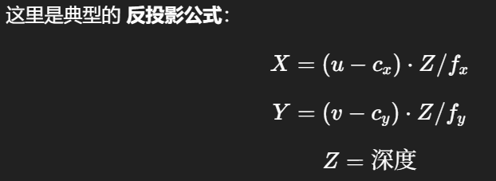
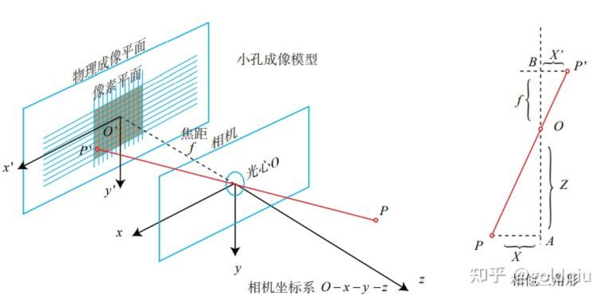
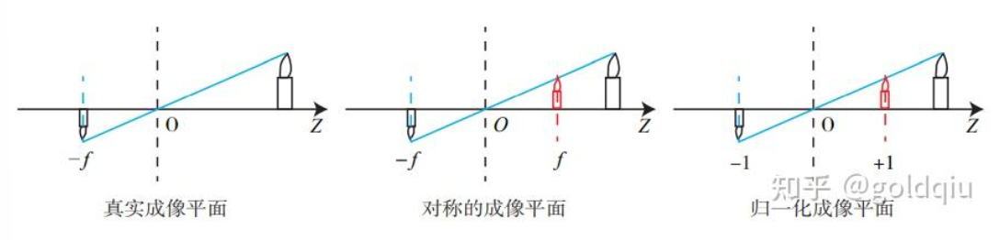
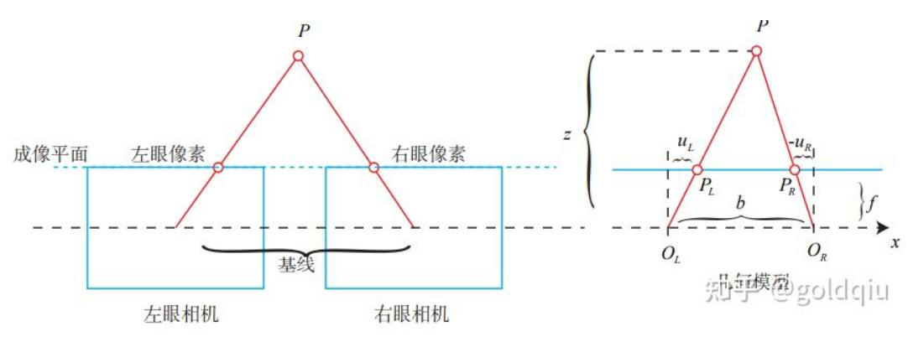

# 总结
## 针孔相机模型
$\begin{cases}
u = f_x\frac{X}{Z} + c_x \\
v = f_y\frac{Y}{Z} + c_y
\end{cases}$

其中，fx = αf, fy = βf。  
f 的单位为米，α,β 的单位为像素/米，所以 fx,fy 和 cx,cy 的单位为像素。写成矩阵形式：

K矩阵称为相机的内参数矩阵（Camera Intrinsics）  

$Z \begin{pmatrix}
u \\
v \\
1
\end{pmatrix} = 
\begin{pmatrix}
f_x & 0 & c_x \\
0 & f_y & c_y \\
0 & 0 & 1
\end{pmatrix}
\begin{pmatrix}
X \\
Y \\
\end{pmatrix}
\stackrel{\Delta}{=} \boldsymbol{KP}$

### 相机内参：单位：像素（px）
1. fx —— 焦距（x 方向）：控制图像在水平方向的缩放比例。
值越大，图像看起来“放大”得越多。  

2. fy —— 焦距（y 方向）：控制图像在竖直方向的缩放比例。  
在理想对称相机中，fx ≈ fy，但实际测量中可能有差异。

3. cx —— 主点横坐标：表示图像中心的水平位置。
理想情况下 cx = 图像宽度 / 2，但实际可能偏移。

4. cy —— 主点纵坐标：表示图像中心的垂直位置。
理想情况下 cy = 图像高度 / 2。

-------------------------
$(RP_w + t) = \underbrace{[X, Y, Z]^T}_{\text{相机坐标}} \rightarrow \underbrace{[X/Z, Y/Z, 1]^T}_{\text{归一化坐标}} \rightarrow \underbrace{[u, v, 1]^T}_{\text{像素坐标}}$  
  
$ZP_{uv} = Z \begin{bmatrix}
u \\
v \\
1
\end{bmatrix} = K(RP_w + t) = KTP_w$  

把一个世界坐标点先转换到相机坐标系，再除掉它最后一维（Z）的数值（即该点距离相机成像平面的深度），这相当于把最后一维进行归一化处理，得到点 P 在相机归一化平面上的投影；归一化坐标再左乘内参就得到了像素坐标。    

从这个模型中可以看出，**对相机坐标同时乘以任意非零常数，归一化坐标都是一样的，这说明点的深度在投影过程中被丢失了**，所以单目视觉中没法得到像素点的深度值。  

### 反投影公式

--------------------------

## 畸变公式

(x,y) 是归一化的理想无畸变相机坐标（单位为相机焦距单位，通常是相机坐标系的归一化平面坐标）

$(x_d,y_d)$ 是畸变后的归一化坐标（实际观测到的，带畸变的点）  

$r^2 = x^2 + y^2$

$x_d = x_{radial} + x_{tangential} = x(1 + k_1 r^2 + k_2 r^4) + 2p_1 xy + p_2(r^2 + 2x^2)$

$y_d = y_{radial} + y_{tangential} = y(1 + k_1 r^2 + k_2 r^4) + p_1(r^2 + 2y^2) + 2p_2 xy$

然后可以再按照针孔模型公式转换为像素坐标。

-------------------------------------------------
## 小结单目相机的成像过程：

1. 首先，世界坐标系下有一个固定的点 P，世界坐标为Pw。  
2. 由于相机在运动，它的运动由 R,t 或变换矩阵T∈SE(3) 描述。P 的相机坐标为 P˜c =RPw + t。  
3. 这时的 P˜c 的分量为 X,Y,Z，把它们投影到归一化平面 Z = 1 上，得到 P 的归一化坐标：Pc = [X/Z,Y /Z,1]T 。  
4. 有畸变时，根据畸变参数计算Pc 发生畸变后的坐标。  
5. 最后，P 的归一化坐标经过内参后，对应到它的像素坐标：Puv = KPc。 一共有四种坐标：世界坐标、相机坐标、归一化坐标和像素坐标。

--------------------------
--------------------------

## 5.1 相机模型
针孔模型: 描述相机将三维世界中的坐标点（单位为米）映射到二维图像平面（单位为像素）的过程  
畸变模型：相机镜头上的透镜的存在，使得光线投影到成像平面的过程中会产生畸变  
这两个模型能够把外部的三维点投影到相机内部成像平面，构成相机的内参数（Intrinsics）。  

### 5.1.1 针孔相机模型
设 O − x − y − z 为相机坐标系，z 轴指向相机前方，x 向右，y 向下。O为摄像机的光心，也是针孔模型中的针孔。  
现实世界的空间点P，经过小孔O投影之后，落在物理成像平面 O′ − x′ − y′ 上，成像点为 P′。  

设 P 的坐标为 $[X,Y,Z]^T$，P′ 为 $[X^′,Y^′,Z^′]^T$，设物理成像平面到小孔的距离为f（焦距）。那么，根据三角形相似关系，有：  
$\frac{Z}{f} = -\frac{X}{X'} = -\frac{Y}{Y'}$  

其中负号表示成的像是倒立的。不过，实际相机得到的图像并不是倒像，可以等价地把成像平面对称地放到相机前方，和三维空间点一起放在摄像机坐标系的同一侧，如图所示。
  
把公式中的负号去掉，X′,Y′ 放到等式左侧，整理得：  

$X' = f\frac{X}{Z}$  

$Y' = f\frac{Y}{Z}$  

这描述了点 P和它的像之间的空间关系。  

不过，在相机中最终获得的是一个个的像素，这还需要在成像平面上对像进行采样和量化。为了描述传感器将感受到的光线转换成图像像素的过程，设在物理成像平面上固定着一个像素平面 o − u − v，在像素平面有P′的像素坐标：$[u,v]^T$。  
像素坐标系即为图形学坐标系：原点o′位于图像的左上角，u 轴正方向向右，v 轴正方向向下。  
像素坐标系与成像平面之间，相差了一个缩放和一个原点的平移。设像素坐标在 u 轴上缩放了 α 倍，在 v 上缩放了 β 倍。  同时，原点平移了 $[cx,cy]^T$。那么，P′ 的坐标与像素坐标$[u,v]^T$ 的关系为：  

$\begin{cases}
u = \alpha X' + c_x \\
v = \beta Y' + c_y
\end{cases}$

把 αf 合并成 fx，把 βf 合并成 fy，得： 

$\begin{cases}
u = f_x\frac{X}{Z} + c_x \\
v = f_y\frac{Y}{Z} + c_y
\end{cases}$

其中，fx = αf, fy = βf。  
f 的单位为米，α,β 的单位为像素/米，所以 fx,fy 和 cx,cy 的单位为像素。写成矩阵形式：  

$Z \begin{pmatrix}
u \\
v \\
1
\end{pmatrix} = 
\begin{pmatrix}
f_x & 0 & c_x \\
0 & f_y & c_y \\
0 & 0 & 1
\end{pmatrix}
\begin{pmatrix}
X \\
Y \\
\end{pmatrix}
\stackrel{\Delta}{=} \boldsymbol{KP}$

K矩阵称为相机的内参数矩阵（Camera Intrinsics）。自己确定相机的内参的过程，也就是所谓的标定。  

-------------------
前面内参公式中的P是物体在相机坐标系下的坐标。  
设物体在世界坐标系下的坐标为$P_w$，物体在像素坐标系下的坐标为$P_{uv}$
设相机位姿由它的旋转矩阵R和平移向量t来描述，转换矩阵为T。则：
 
$ZP_{uv} = Z \begin{bmatrix}
u \\
v \\
1
\end{bmatrix} = K(RP_w + t) = KTP_w$

上式描述了P的世界坐标到像素坐标的投影关系。  
相机的位姿R,t称为相机的外参数（Camera Extrinsics）。

相比于不变的内参，外参会随着相机运动发生改变，同时也是 SLAM 中待估计的目标，代表着机器人的轨迹。  
式子表明，可以把一个世界坐标点先转换到相机坐标系，再除掉它最后一维（Z）的数值（即该点距离相机成像平面的深度），这相当于把最后一维进行归一化处理，得到点 P 在相机归一化平面上的投影：  
$(RP_w + t) = \underbrace{[X, Y, Z]^T}_{\text{相机坐标}} \rightarrow \underbrace{[X/Z, Y/Z, 1]^T}_{\text{归一化坐标}}$  
归一化坐标可看成相机前方z=1处的平面上的一个点，这个 z = 1 平面也称为归一化平面。归一化坐标再左乘内参就得到了像素坐标。所以可以把像素坐标 $[u,v]^T$ 看成对归一化平面上的点进行量化测量的结果。  

从这个模型中可以看出，**对相机坐标同时乘以任意非零常数，归一化坐标都是一样的，这说明点的深度在投影过程中被丢失了**，所以单目视觉中没法得到像素点的深度值。

### 5.1.2 畸变
一是透镜自身的形状对光线传播的影响，引起的径向畸变（Distortion，也叫失真）：在针孔模型中，一条直线投影到像素平面上还是一条直线。可是，在实际拍摄的照片中，摄像机的透镜往往使得真实环境中的一条直线在图片中变成了曲线 。   
二是在机械组装过程中，透镜和成像平面不可能完全平行，这也会使得光线穿过透镜投影到成像面时的位置发生变化，这引入切向畸变。  

对于相机坐标系中的一点P，能够通过 5 个畸变系数找到这个点在像素平面上的正确位置：

1. 将三维空间点投影到归一化图像平面。设它的归一化坐标为 $[x,y]^T$。  
2. 对归一化平面上的点计算径向畸变和切向畸变。  
3. 将畸变后的点通过内参数矩阵投影到像素平面，得到该点在图像上的正确位置。  
在实际应用中，可以灵活选择纠正模型，比如只选择 k1,p1,p2 这 3 项等。  

### 5.1.3 双目相机模型 
对于单目相机而言，从相机光心到归一化平面连线上的所有点，都可以投影至同一像素上，相当于没有了Z轴维度。  
双目相机一般由左眼相机和右眼相机两个水平放置的相机组成。在左右双目相机中，我们可以把两个相机都看作针孔相机。  
它们是水平放置的，意味着两个相机的光圈中心都位于（相机坐标系的） x 轴上。两者之间的距离称为**双目相机的基线（Baseline，记作 b）**，是双目相机的重要参数。  
  
  
考虑一个空间点 P，它在左眼相机和右眼相机各成一像，记作 $P_L$, $P_R$。由于相机基线的存在，这两个成像位置是不同的。理想情况下，由于左右相机只在 x 轴上有位移，因此 P 的像也只在 x 轴（对应图像的u轴）上有差异。记它在左侧相机坐标系中坐标为 $u_L$，右侧相机坐标系中坐标为 $u_R$。  
根据 $△PP_LP_R$ 和 $△PO_LO_R$ 的相似关系，整理得：  
$z = \frac{fb}{d}, \quad d \stackrel{\Delta}{=} u_{I} - u_{R}$  
注意，按照图中坐标定义，uR 应该是负数，所以图中标出的距离为 −uR。  
其中 **d 定义为左右图的横坐标之差，称为视差（Disparity）**。根据视差，我们可以估计一个像素与相机之间的距离。视差与距离成反比：视差越大，距离越近。  

视差 d 计算的主要困难：需要确切地知道像素的对应关系。  
当想计算每个像素的深度时，其计算量与精度都将成为问题，而且**只有在图像纹理变化丰富的地方才能计算视差**。由于计算量的原因，双目深度估计仍需要使用 GPU 或FPGA 来实时计算。  

### 5.1.4 RGB-D相机模型
RGB-D 相机是主动测量每个像素的深度。目前的 RGB-D 相机按原理可分为两大类：  
1. 红外结构光（Structured Light）： Kinect 1 代、Project Tango 1 代、Intel RealSense 等。
2. 通过飞行时间法（Time-of-flight，ToF）：Kinect 2 代和一些现有的 ToF 传感器等。  

无论是哪种类型，RGB-D 相机都需要向探测目标发射一束光线（通常是红外光）。  
在结构光原理中，相机根据返回的结构光图案，计算物体与自身之间的距离。  
在 ToF 原理中，相机根据脉冲光发送到返回之间的光束飞行时间，确定物体与自身之间的距离。ToF原理的相机和激光雷达十分相似，只不过激光雷达是通过逐点扫描来获取这个物体的距离，而ToF相机则可以获得整个图像的像素深度。  

在测量深度之后，RGB-D 相机通常按照生产时的相机摆放位置，自己完成深度与彩色图像素之间的配对，输出一一对应的彩色图和深度图。**可以在同一个图像位置，读取到色彩信息和距离信息，计算像素的 3D 相机坐标，生成点云（Point Cloud）**。**对 RGB-D 数据，既可以在图像层面进行处理，也可在点云层面处理**。  

RGB-D 相机缺点：  
1. 红外光容易受到日光或其他传感器发射的红外光干扰，因此不能在室外使用。  
2. 在没有调制的情况下，同时使用多个 RGB-D 相机时也会相互干扰。
3. 对于透射材质的物体，因为接收不到反射光，所以无法测量这些点的位置。