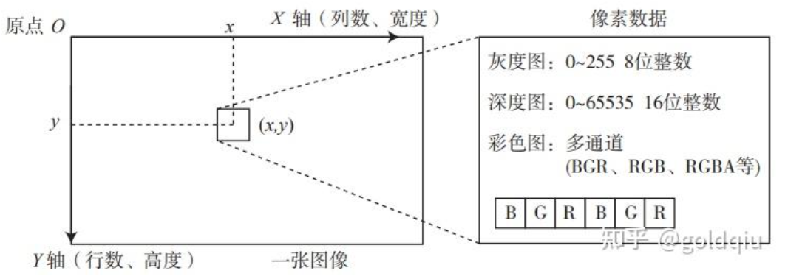

在数学中，图像可以用一个矩阵来描述；而在计算机中，它们占据一段连续的磁盘或内存空间，可以用二维数组来表示。  

### 灰度图
每个像素位置 (x,y) 对应一个灰度值 I，一张宽度为 w、高度为 h 的图像，数学上可以记为一个函数：$I(x,y) : \mathbb{R}^2 \to \mathbb{R}$，其中 (x,y) 是像素的坐标。  
然而，计算机并不能表达实数空间。在常见的灰度图中，用 0~255 的整数（一个 unsigned char或1 个字节）来表达图像的灰度读数。  
一张宽度为 640 像素、高度为 480 像素分辨率的灰度图就可以表示为：  
```
unsigned char image[480][640] //二维数组表达图像
```  
像素坐标系原点位于图像的左上角，X 轴向右，Y 轴向下（也就是u,v* 坐标）。如果还有第三个轴—Z 轴，根据右手法则，Z 轴向前。这种定义方式是与相机坐标系一致的。  
图像的宽度或列数，对应着 X 轴；而图像的行数或高度，则对应着它的 Y 轴。  
  
根据这种定义方式，访问一个位于 x,y 处的像素，那么在程序中应该是：  
```
unsigned char pixel = image[y][x];  //访问图像像素
```  
它对应着灰度值 I(x,y) 的读数。 
  

### 深度图
在 RGB-D 相机的深度图中，记录了各个像素与相机之间的距离。这个距离通常是以毫米为单位，而 RGB-D 相机的量程通常在十几米左右，超过了 255。  
这时会采用 16 位整数（unsigned short）来记录深度图的信息，也就是位于 0~65535 的值。换算成米的话，最大可以表示 65 米，足够 RGB-D 相机使用。  

### 彩色图像  
彩色图像的表示则需要通道（channel）的概念。在计算机中，用红色、绿色和蓝色这三种颜色的组合来表达任意一种色彩。  
于是对于每一个像素，就要记录其 R、G、B 三个数值，每一个数值就称为一个通道。最常见的彩色图像有三个通道，每个通道都由 8 位整数表示。在这种规定下，一个像素占据 24 位空间。  
通道的数量、顺序都是可以自由定义的。在 OpenCV 的彩色图像中，通道的默认顺序是 B、G、R。  
如果还想表达图像的透明度，就使用 R、G、B、A 四个通道。


----------------

### OpenCV
安装后，OpenCV 默认存储在/usr/local 目录下