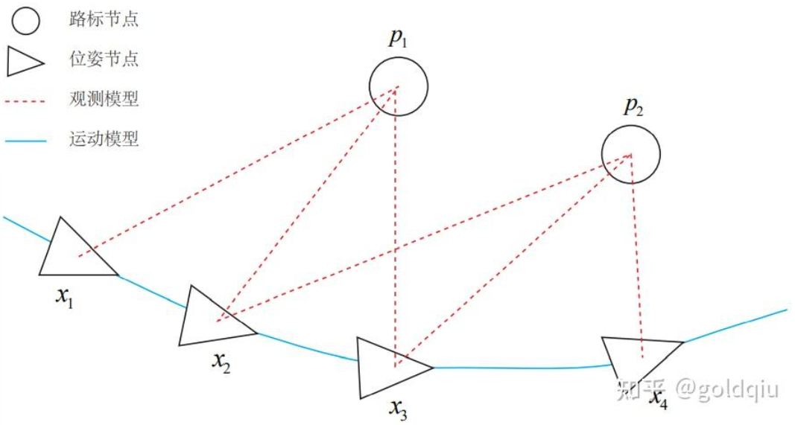

### 总结

https://zhuanlan.zhihu.com/p/462463343

### 经典 SLAM 模型：  

运动方程：$\boldsymbol{x}_k = f(\boldsymbol{x}_{k-1}, \boldsymbol{u}_k) + \boldsymbol{w}_k$  
观测方程：$z_{k,j} = h(\boldsymbol{y}_j, \boldsymbol{x}_k) + v_k$

$x_k$是相机的位姿变量，可以由$T_k∈SE(3)$表达，$u_k$是动作或控制输入，$y_j$是路标点。  

观测方程则由针孔模型给定:  

$sz_{k,j} = \boldsymbol{K}(\boldsymbol{R}_k \boldsymbol{y}_j + \boldsymbol{t}_k)$    
假设在$x_k$处对路标$y_j$进行了一次观测，对应到图像上的像素位置$z_{k,j}$，其中K为相机内参，s为路标的距离，也是$(R_ky_j +t_k)$的第三个分量。  

在运动和观测方程中，通常假设两个噪声项$w_k$, $v_k$, j 满足零均值的高斯分布：  
$w_k \sim \mathcal{N}(0, R_k), v_k \sim \mathcal{N}(0, Q_{k,j})$  
$R_k, Q_{k,j}$为协方差矩阵

在这些噪声的影响下，希望通过带噪声的数据z和u推断位姿x和地图y（以及它们的概率分布），这构成了一个状态估计问题。

-----------------------------------------
### 状态估计问题的方法分成两种：
第一种：增量（incremental）的方法/滤波器    
持有一个当前时刻的估计状态，然后用新的数据来更新它。  

第二种：批量（batch）的方法  
把数据累加起来一并处理，估计全时刻的轨迹与地图。

------------

### 图优化理论简介
图优化，是把优化问题表现成图（Graph）的一种方式。  
这里的图是图论意义上的图。一个图由若干个顶点（Vertex），以及连接着这些顶点的边（Edge）组成。进而，用顶点表示优化变量，用边表示误差项。于是，对任意一个上述形式的非线性最小二乘问题，可以构建与之对应的一个图。可以简单地称它为图，也可以用概率图里的定义，称之为贝叶斯图或因子图。  

  

用三角形表示相机位姿节点，用圆形表示路标点，它们构成了图优化的顶点；同时，实线表示相机的运动模型，虚线表示观测模型，它们构成了图优化的边。最基本的图优化是用图模型来表达一个非线性最小二乘的优化问题，可以利用图模型的某些性质做更好的优化。  

