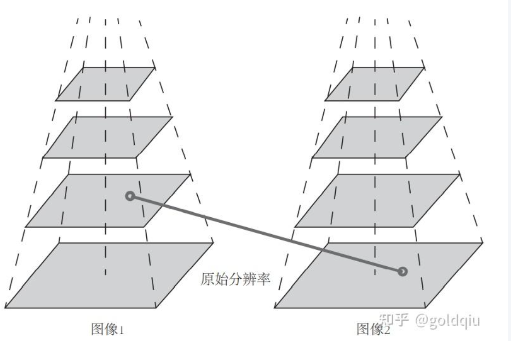

在经典SLAM模型中特征点即为路标(Landmark)  
而在视觉 SLAM 中,路标则是指图像特征(Feature)  

特征点：角点、边缘和区块等图像中有代表性的地方  
角点的提取算法有很多,例如 Harris 角点、FAST 角点 、GFTT 角点    
其他人工设计的特征点,如著名的SIFT 、SURF 、ORB ，相比于普通角点拥有如下的性质:  
1. 可重复性(Repeatability):相同的特征可以在不同的图像中找到。
2. 可区别性(Distinctiveness):不同的特征有不同的表达。
3. 高效率(Efficiency):同一图像中,特征点的数量应远小于像素的数量。
4. 本地性(Locality):特征仅与一小片图像区域相关。

特征点由**关键点**(Key-point)和 **描述子**(Descriptor)两部分组成。  

## ORB 特征
提取 ORB 特征分为如下两个步骤:
1. FAST 角点提取:找出图像中的“角点”。相较于原版的 FAST,ORB中计算了特征点的主方向,为后续的BRIEF描述子增加了旋转不变特性。
2. BRIEF 描述子:对前一步提取出特征点的周围图像区域进行描述。ORB 对BRIEF进行了一些改进,主要是指在 BRIEF中使用了先前计算的方向信息。
3. 特征匹配  

### 第一步：寻找FAST 关键点
FAST 是一种角点,主要检测局部像素灰度变化明显的地方,以速度快著称。

**对每一个像素执行相同的操作：**
1. 在图像中选取像素p,假设它的亮度为$I_p$。  
2. 设置一个阈值T (比如,$I_p$ 的20%)。  
3. 以像素p为中心,选取半径为3的圆上的16个像素点。  
4. 快速初步判断：检查圆周上与 p 间隔 90 度（即 1, 5, 9, 13 号点）的 4 个像素点。如果这 4 个点中有至少 3 个点，其亮度都比 p 的亮度加上阈值 t 还亮，或者都比 p 的亮度减去阈值 t 还暗，那么 p 就有可能是一个角点。  
如果这个快速测试失败，那么 p 肯定不是角点，可以直接排除。这个步骤大大减少了计算量。
5. (如果初步判断通过)完整测试：
假如选取的圆上有连续的N个点的亮度大于 Ip + T 或小于 Ip − T,那么像素p可以被认为是特征点(N通常取12,即为 FAST-12。其他常用的 N 取值为 9 和 11,它们分别被称为FAST-9 和 FAST-11)。  

缺点：  
FAST特征点的计算仅仅是比较像素间亮度的差异，重复性不强，分布不均匀。  
FAST角点不具有方向信息。  
由于它固定取半径为3的圆，存在尺度问题：远处看着像是角点的地方，接近后看可能就不是角点了。  

**ORB添加了尺度和旋转的描述**：  
针对FAST角点不具有方向性和尺度的弱点，ORB添加了尺度和旋转的描述。  
尺度不变性由构建图像金字塔，并在金字塔的每一层上检测角点来实现。  
而特征的旋转是由灰度质心法（Intensity Centroid）实现的。  
  
金字塔底层是原始图像。每往上一层，就对图像进行一个固定倍率的缩放，这样就有了不同分辨率的图像。较小的图像可以看成是远处看过来的场景。在特征匹配算法中可以匹配不同层上的图像，从而实现尺度不变性。 例如，如果相机在后退，那么应该能够在上一个图像金字塔的上层和下一个图像的下层中找到匹配。 在旋转方面，计算特征点附近的图像灰度质心。  
所谓质心是指以图像块灰度值作为权重的中心:  
在一个小的图像块B中，定义图像块的矩为$m_{pq} = \sum_{x, y \in B} x^p y^q I(x, y), \quad p, q = \{0, 1\}$, 通过矩可以找到图像块的质心：$C = \left( \frac{m_{10}}{m_{00}}, \frac{m_{01}}{m_{00}} \right)$, 连接图像块的几何中心O与质心 C，得到一个方向向量 OC，于是特征点的方向可以定义为$\theta = \arctan\left(\frac{m_{01}}{m_{10}}\right)$  
通过以上方法，FAST角点便具有了尺度与旋转的描述，从而大大提升了其在不同图像之间表述的鲁棒性。  

注：金字塔是指对图像进行不同层次的降采样，以获得不同分辨率的图像。

### 第二步：计算BRIEF 描述子
BRIEF 是一种二进制描述子，其描述向量由许多个0和1组成。这里的0和1编码了关键点附近两个随机像素（比如 p 和 q）的大小关系：如果 p 比 q 大，则取 1，反之就取 0。如果取了 128 个这样的 p, q，最后就得到128维由 0、1 组成的向量。  
原始的 BRIEF描述子不具有旋转不变性，因此在图像发生旋转时容易丢失。而 ORB 在 FAST 特征点提取阶段计算了关键点的方向，所以可以利用方向信息，计算了旋转之后的“Steer BRIEF”特征使ORB 的描述子具有较好的旋转不变性。  

### 第三步：特征匹配
考虑两个时刻的图像，将两图像中提取到的特征点视为两个集合，如何寻找这两个集合元素的对应关系？  
暴力匹配（Brute-Force Matcher）：即对每一个特征点 $x^m_t$ 与所有的 $x^n_{t+1}$ 测量描述子的距离，然后排序，取最近的一 个作为匹配点。对于二进制的描述子（比如BRIEF），往往使用汉明距离（Hamming distance）作为度量范数。  

快速近似最近邻（FLANN）算法：更加适合于匹配点数量极多的情况。这些匹配算法理论已经成熟，实现上集成到OpenCV了。