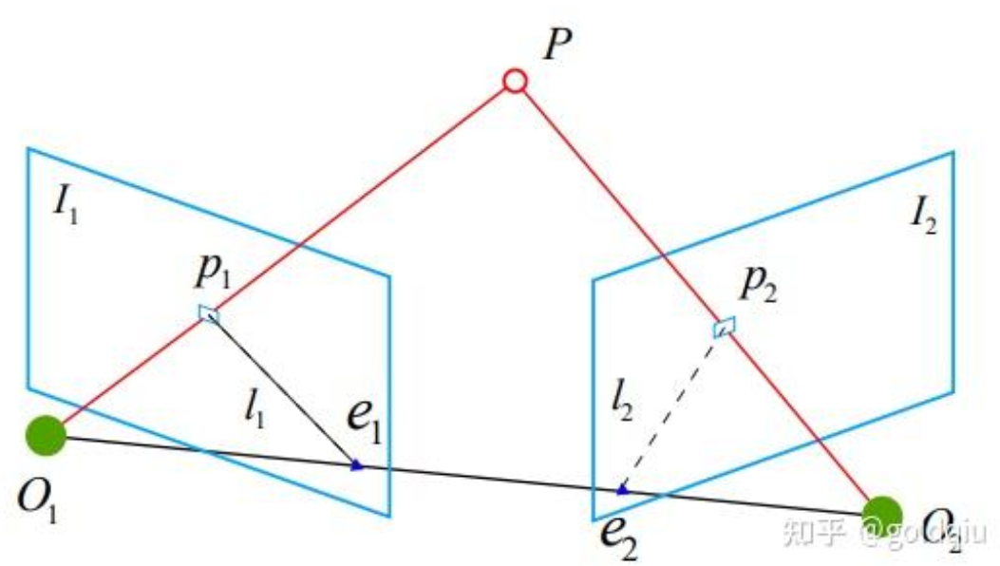

### 对极约束

求取两帧图像$I_1, I_2$之间的运动,设第一帧到第二帧的运动为$R,t$。  
两个相机中心分别为$O_1,O_2$。如果$I_1$ 中有一个特征点 $p_1$ ,它在 $I_2$ 中对应着特征点 $p_2$，它们是同一个空间点在两个成像平面上的投影。  
首先,连线 $O_1-p_1$ 和连线 $O_2-p_2$ 在三维空间中会相交于点P。  
这时候点$O_1,O_2 ,P$三个点可以确定一个平面,称为极平面(Epipolar plane) 。  
$O_1,O_2$ 连线与像平面$I_1$, $I_2$ 的交点分别为$ e_1, e_2 。e_1, e_2$ 称为极点(Epipoles) , $O_1,O_2$被称为基线(Baseline) 。  
称极平面与两个像平面 $I_1, I_2$ 之间的相交线 $L_1, L_2$ 极线(Epipolar line) 。  

这里的$x_1,x_2$是两个像素点的归一化平面上的坐标，$p_1, p_1$是两个像素点的像素坐标。  

对极约束：  
$$ \quad x_2^TE x_1 = p_2^T F p_1 = 0$$

其中$ E = t^{\wedge}R, \quad F = K^{-T}EK^{-1} $  
基础矩阵(Fundamental Matrix)F和本质矩阵(Essential Matrix)E。  

对极约束简洁地给出了两个匹配点的空间位置关系。于是,相机位姿估计问题变为以下两步:  
1. 根据配对点的像素位置求出 E 或者 F 。  
2. 根据E或者F求出 R, t。由于 E 和 F 只相差了相机内参,而内参在SLAM中通常是已知的,所以实践当中往往使用形式更简单的E。

### 本质矩阵
根据定义,本质矩阵 E = t∧R。它是一个3 × 3的矩阵,内有 9 个未知数。  
1.  本质矩阵是由对极约束定义的。由于对极约束是等式为零的约束,所以对E乘以任意非零常数后,对极约束依然满足。这称为E在不同尺度下是等价的。  
2. 根据 E = t∧R,可以证明,本质矩阵E的奇异值必定是 [σ, σ, 0]T的形式。这称为本质矩阵的内在性质。
3. 由于平移和旋转各有 3 个自由度,故 t∧R 共有 6 个自由度。但由于尺度等价性,故 E 实际上有 5 个自由度。表明最少可以用5对点来求解E。
4. 但是,E的内在性质是一种非线性性质,在估计时会带来麻烦,因此,也可以只考虑它的尺度等价性,**使用8对点来估计E**——这就是经典的**八点法(Eight-point-algorithm)** 。八点法只利用了E的线性性质,因此可以在线性代数框架下求解。

关于具体的方程解法，参考该博客后半部分：  
https://zhuanlan.zhihu.com/p/463933793  