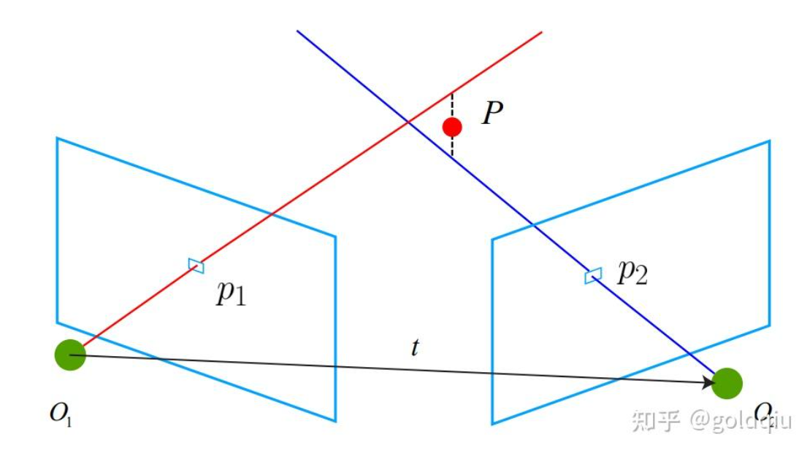
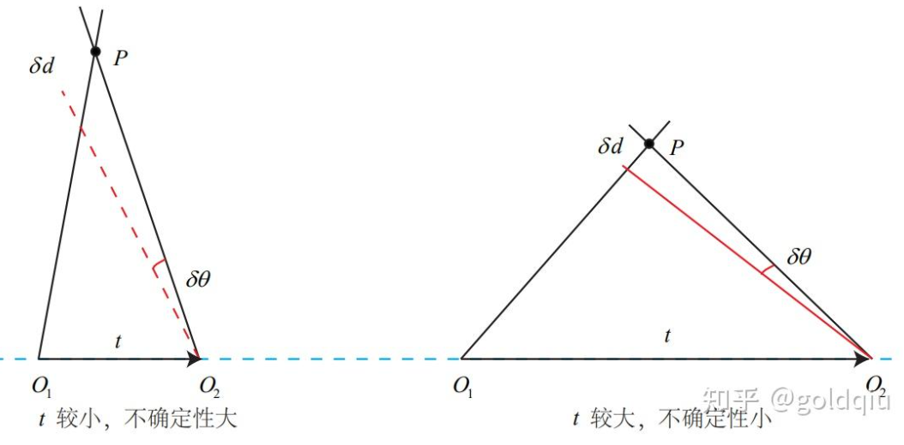

使用对极几何约束估计了相机运动之后，下一步需要用相机的运动估计特征点的空间位置。  

在单目SLAM中，仅通过单张图像无法获得像素的深度信息，需要通过三角测量（Triangulation）（或三角化）的方法来估计地图点的深度。

三角测量是指，通过在两处观察同一个点的夹角，确定该点的距离。  

  

考虑图像 $I_1$ 和 $I_2$，以左图为参考，右图的变换矩阵为 T。相机光心 为 $O_1$ 和 $O_2$。在 $I_1$ 中有特征点 $p_1$，对应 $I_2$ 中有特征点 $p_2$。理论上直线 $O_1-p_1$ 与 $O_2-p_2$ 在场景中会相交于一点 P，该点即是两个特征点所对应的地图点在三维场景中的位置。  
按照对极几何中的定义，设 $x_1,x_2$ 为两个特征点的归一化坐标，那么它们满足：   
$s_1x_1 = s_2Rx_2 + t$.  

已知 R, t，想要求解的是两个特征点的深度 $s_1, s_2$。这两个深度是可以分开求的，先算 $s_2$ ，那么先对上式两侧左乘一个$x_1^{\wedge}$，得：

$s_1 \boldsymbol{x}_1^{\wedge} \boldsymbol{x}_1 = 0 = s_2 \boldsymbol{x}_1^{\wedge} \boldsymbol{R} \boldsymbol{x}_2 + \boldsymbol{x}_1^{\wedge} \boldsymbol{t}$  

该式左侧为零，右侧可看成 s2 的一个方程，可以根据它直接求得 s2。有了 s2，s1也可以求出。于是就得到了两个帧下的点的深度，确定了它们的空间坐标。  

由于噪声的存在，估得的 R, t不一定精确使方程为0，所以**更常见的做法求最小二乘解而不是零解**。

---------------

### 讨论
三角测量是由平移得到的，有平移才会有对极几何中的三角形，才谈的上三角测量。因此，纯旋转是无法使用三角测量的，因为对极约束将永远满足。在平移存在的情况下，还要关心三角测量的不确定性，这会引出一个三角测量的矛盾。    

  

如图所示。当平移很小时，像素上的不确定性将导致较大的深度不确定性。也就是说，如果特征点运动一个像素 δx，使得视线角变化了一个角度 δθ，那么测量到深度值将有 δd 的变化。从几何关系可以看到，当 t 较大时，δd 将明显变小，这说明平移较大时， 在同样的相机分辨率下，三角化测量将更精确。对该过程的定量分析可以使用正弦定理得到，但这里先考虑定性分析。   
 因此，要增加三角化的精度，其一是提高特征点的提取精度，也就是提高图像分辨率 ——但这会导致图像变大，提高计算成本。另一方式是使平移量增大。但是，平移量增大会导致图像的外观发生明显的变化，比如箱子原先被挡住的侧面显示出来了，比如反射光发生变化了，等等。外观变化会使得特征提取与匹配变得困难。  
 总而言之，增大平移，会导致匹配失效；而平移太小，则三角化精度不够——这就是三角化的矛盾。

拓展：定量地计算每个特征点的位置及不确定性。假设特征点服从高斯分布，并且对它不断地进行观测，在信息正确的情况下，就能够期望它的方差会不断减小乃至收敛。这就得到了一个滤波器，称为深度滤波器（Depth Filter）。