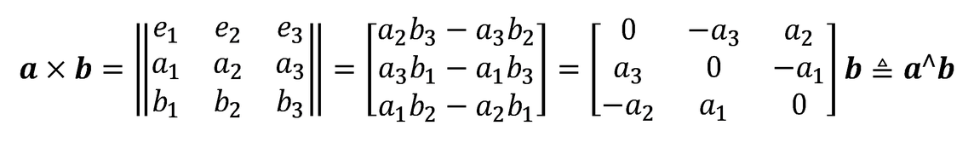
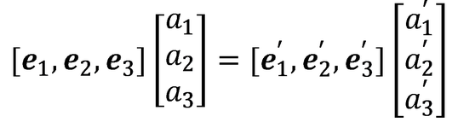
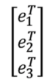
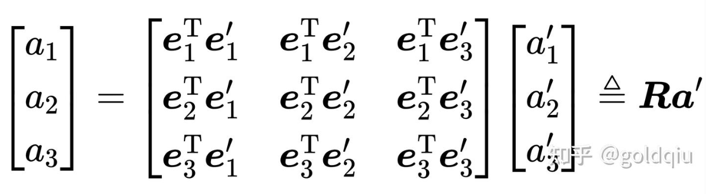
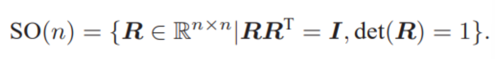
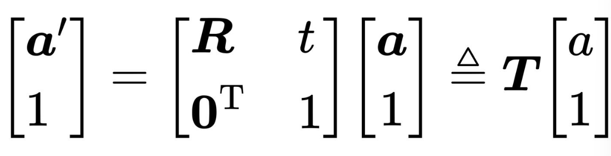
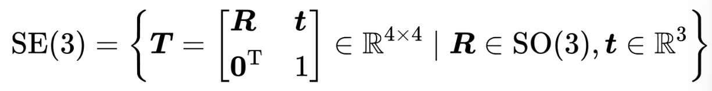

### 向量外积：
外积的结果是一个向量，它的方向垂直于这两个向量，大小为 |a||b|sin⟨a,b⟩，是两个向量张成的四边形的有向面积。  
对于外积运算，引入∧符号，把a写成一个反对称矩阵（Skew-symmetric matrix），把外积a × b写成了矩阵与向量的乘法a∧b，把它变成了线性运算。  
这意味着任意向量都对应着唯一的一个反对称矩阵，反之亦然。  
  

### 坐标系间的欧氏变换：
设某个单位正交基 (e1, e2, e3) 经过一次旋转变成了 (e1', e2', e3') ，那么，对于同一个向量 a（该向量并没有随着坐标系的旋转而发生运动），它在两个坐标系下的坐标为[a1, a2, a3]和[a1', a2', a3']。因为向量本身没变，根据坐标的定义，有：  
     
对上述等式的左右两边同时左乘：
     
那么左边的系数就变成了单位矩阵，把中间的矩阵拿出来，定义成一个旋转矩阵R：
  
该矩阵各分量是两个坐标系基的内积，由于基向量的长度为1，所以实际上是各基向量的夹角之余弦。所以这个矩阵也叫方向余弦矩阵（Direction Cosine matrix）。  
行列式为1的正交矩阵==旋转矩阵，以把 n 维旋转矩阵的集合定义如下：

SO(n) 是特殊正交群（Special Orthogonal Group）的意思。这个集合由n维空间的旋转矩阵组成，特别地，SO(3) 就是指三维空间的旋转。  
注：由于旋转矩阵为正交矩阵，它的逆（即转置）描述了一个相反的旋转  
在欧氏变换中，除了旋转之外还有平移。考虑世界坐标系中的向量a，经过一次旋转（用R描述）和一次平移t后，得到了a′，把旋转和平移合到一起，有：a′ = Ra + t. t称为平移向量。平移部分只需把平移向量加到旋转之后的坐标上。
##### 总结
用一个旋转矩阵R和一个平移向量t完整地描述了一个欧氏空间的坐标变换关系。定义坐标系1、坐标系2，那么向量a在两个系下坐标为 a1, a2 ，完整的写法：$a_1 = R_{12}a_2 + t_{12}.$  
注：行列式为1是人为定义的，实际上只要求它的行列式为 ±1，但行列式为 −1 的称为瑕旋转，即一次旋转加一次反射。

### 变换矩阵与齐次坐标：
矩阵T称为变换矩阵  
  
变换矩阵T具有比较特别的结构：左上角为旋转矩阵，右侧为平移向量，左下角为0 向量，右下角为 1。这种矩阵又称为特殊欧氏群（Special Euclidean Group）  
  
与 SO(3) 一样，求解该矩阵的逆表示一个反向的变换：  
    
